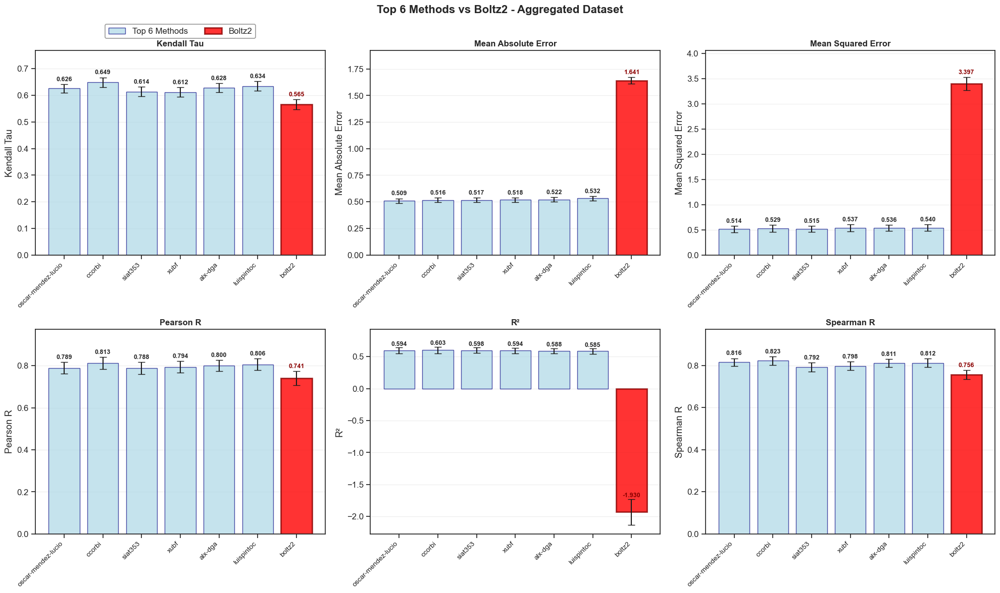
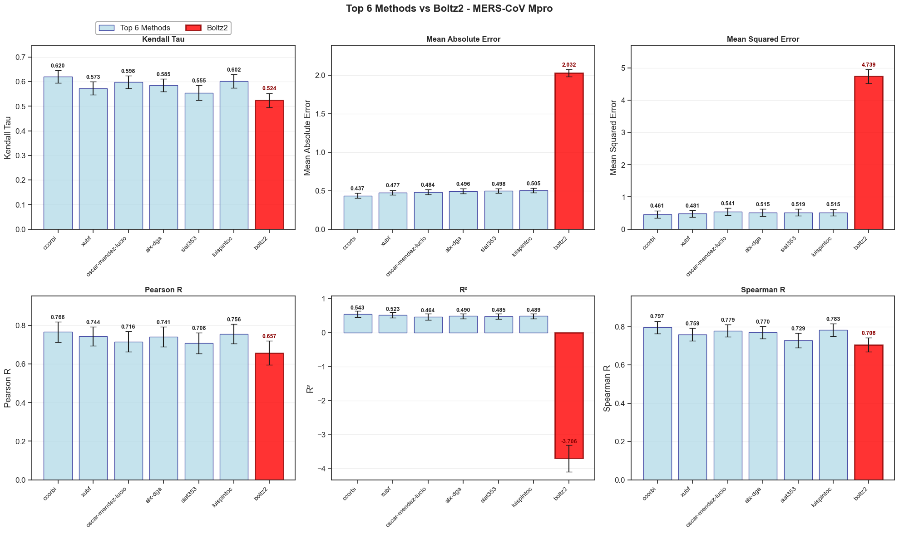

# Boltz Polaris Potency Evaluation

This repository contains evaluation scripts and results for the Boltz model's performance on the Polaris blind challenge datasets, specifically focusing on antiviral potency, ligand poses, and ADMET predictions.

## Results Summary
### Aggregated Performance

### SARS-CoV-2 

### MERS-CoV Performance


**Performance Summary:**
- **Ranking**: 33rd/33 methods across all datasets for MAE
- **Correlation Performance**: 20-21st/33 methods (39-42nd percentile)
- **Best Performance**: SARS-CoV-2 target (Pearson R: 0.824)
- **Target Preference**: Consistently better on SARS-CoV-2 vs MERS-CoV

## Project Structure

```
├── boltz_affinity_predictions.csv          # Affinity prediction results
├── boltz_polaris_evaluation.ipynb          # Main evaluation notebook
├── code_to_create_yamls.py                 # YAML configuration generator
├── env.yml                                 # Conda environment specification
├── evaluation/                             # Evaluation modules
│   ├── admet.py                           # ADMET evaluation functions
│   ├── bootstrapping.py                   # Statistical bootstrapping utilities
│   ├── cld.py                             # CLD (Chemical Library Design) evaluation
│   ├── ligand_poses.py                    # Ligand pose evaluation
│   ├── potency.py                         # Potency prediction evaluation
│   ├── utils.py                           # Common utilities
│   └── data/                              # Evaluation datasets
└── leaderboards/                          # Challenge leaderboard submissions
    ├── antiviral-admet-2025/              # ADMET challenge results
    ├── antiviral-ligand-poses-2025/       # Ligand poses challenge results
    └── antiviral-potency-2025/            # Potency challenge results
```

## Setup

1. **Create the conda environment:**
   ```bash
   conda env create -f env.yml
   conda activate boltz-polaris
   ```

2. **Generate YAML configurations for Boltz 2:**
   ```bash
   python code_to_create_yamls.py
   ```

3. **Run Boltz 2 predictions (not included in this repo):**
   ```bash
   boltz predict ./yaml_files/*.yaml --use_msa_server --use_potentials --no_kernel
   ```
4. **Run the evaluation notebook:**
   ```bash
   jupyter notebook boltz_polaris_evaluation.ipynb
   ```

## Usage

**Generate YAML configurations for Boltz 2 input:**
```bash
python code_to_create_yamls.py
```

**Run evaluations:**
```python
from evaluation import potency, ligand_poses, admet
# Use evaluation functions as needed
```

## Results

**Boltz 2 Model Performance:**
- Detailed affinity predictions available in [`boltz_affinity_predictions.csv`](boltz_affinity_predictions.csv)
- Complete evaluation metrics and rankings can be generated from [`boltz_polaris_evaluation.ipynb`](boltz_polaris_evaluation.ipynb)
- All leaderboard comparisons are documented in `all_the_comparisons.txt`
- Visual performance comparisons shown in the generated image files from the notebook

**Performance Summary:**
- Boltz2 consistently ranks last in the evaluated methods subset
- Shows better correlation metrics than absolute error metrics
- Performs better on SARS-CoV-2 target compared to MERS-CoV across all metrics


## Attribution

The evaluation framework is adapted from the [ASAP Polaris Blind Challenge Examples](https://github.com/asapdiscovery/asap-polaris-blind-challenge-examples) repository (accessed August 21st, 2025).